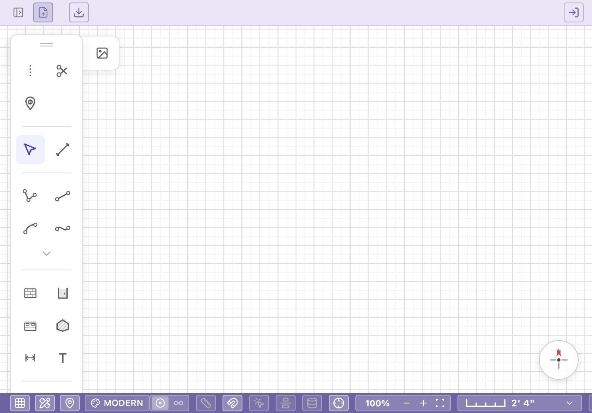
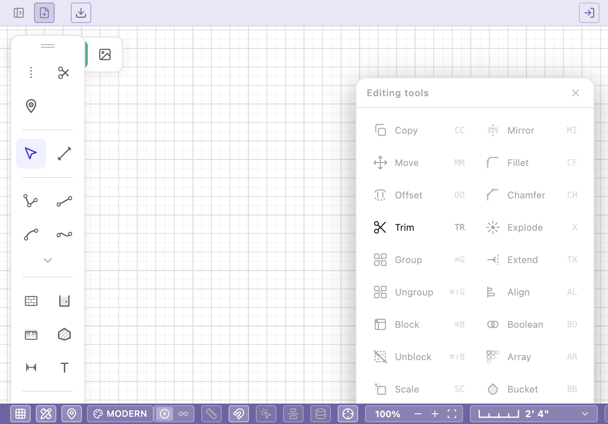
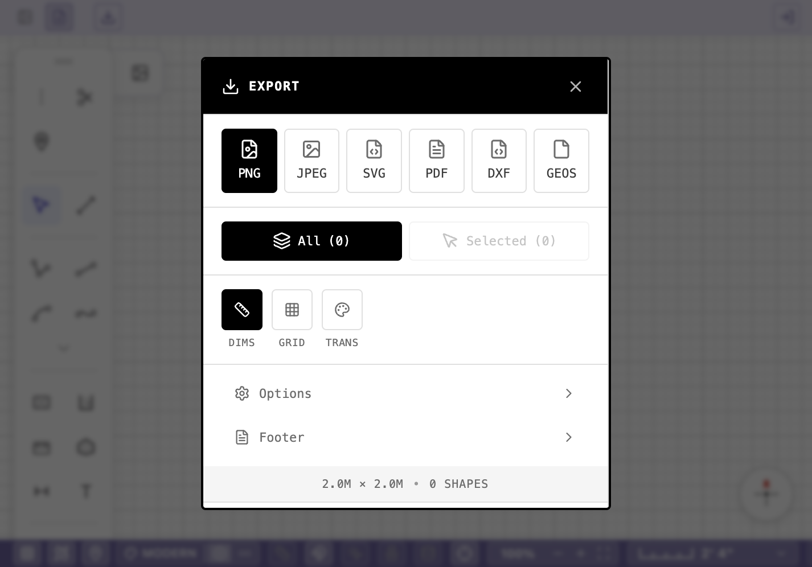

# Maya CAD v1.0

Maya CAD is a browser-based CAD and floor plan design workspace for drawing, editing, measuring, and exporting architectural layouts. It is built as a Vite + React application with a canvas-first interface powered by Konva, and it runs as a fully static web application with no backend or authentication required by default.


---

## Table of Contents

- [Overview](#overview)
- [Demo Video](#demo-video)
- [Screenshots](#screenshots)
- [Features](#features)
- [Tech Stack](#tech-stack)
- [Getting Started](#getting-started)
- [Available Scripts](#available-scripts)
- [Deployment](#deployment)
- [Environment Variables](#environment-variables)
- [Project Structure](#project-structure)
- [Security](#security)
- [Documentation](#documentation)

---

## Overview

Maya CAD opens directly into a grid-based design workspace. The core interaction model centers on the canvas, with toolbars, contextual panels, and editing controls arranged around it. Users select a drawing tool, place geometry on the canvas, refine it with snapping and precision input, and export the result in a variety of formats.

The application is structured around five primary workflows:

1. **Drawing** - Select a tool such as wall, line, rectangle, room, opening, dimension, or text, then click or drag to place geometry on the canvas.
2. **Snapping and precision** - Use grid snapping, endpoint and midpoint detection, guides, markers, and coordinate-style precision input to keep drawings accurate.
3. **Editing** - Select shapes to move, resize, rotate, mirror, trim, group, fillet, or restyle them.
4. **Annotation** - Add measurements, dimension labels, text notes, and markers to communicate the layout clearly.
5. **Export** - Output the drawing as PNG, JPEG, SVG, PDF, DXF, or the native GEOS workspace format.

---

## Demo Video

A full walkthrough video is available on GitHub Releases:

[Watch or download the Maya CAD v1.0 demo video](https://github.com/sursorot/maya-cad-v1.0/releases/tag/v1.0-demo)

---

## Screenshots

### Main Workspace

The main workspace provides a grid-based drawing canvas with a vertical tool palette, bottom control bar, zoom controls, scale indicator, snapping controls, and a theme selector.



### Editing Tools Panel

The editing panel exposes CAD-style operations including copy, move, offset, trim, group, mirror, fillet, chamfer, explode, align, array, and rotate.



### Export Panel

The export panel supports PNG, JPEG, SVG, PDF, DXF, and the native GEOS workspace format, with controls for output dimensions, grid visibility, transparency, and export scope.



---

## Features

### Canvas Workspace

- Infinite-feeling drawing surface with smooth pan and zoom.
- Layered rendering for shapes, measurements, markers, overlays, and active drawing previews.
- Shape selection with bounding boxes, resize handles, and rotation controls.
- Trace image support for drafting over reference images.

### Architectural Drawing Tools

- Wall drawing with connected centerlines and resolved wall geometry.
- Door, window, and opening placement directly on wall segments.
- Room and zone tools for defining enclosed spaces and labeled areas.
- Measurement overlays for lengths, spans, areas, and dimension callouts.

### Precision and Drafting

- Coordinate-style precision input for exact placement.
- Snapping to endpoints, midpoints, centers, grid intersections, guides, markers, and alignment axes.
- Orthogonal drawing mode for cleaner rectilinear layouts.
- Persistent guidelines and markers for repeatable alignment across a drawing session.

### Editing and Styling

- Move, copy, paste, rotate, resize, mirror, group, ungroup, trim, fillet, and explode operations.
- Per-shape style editing for stroke color, fill, opacity, blend mode, shadows, and style presets.
- Contextual action hints and a shortcut reference modal.

### Interface Themes

- Five toolbar themes: Clean, Modern, Cyber, Funk, and Windows 95.
- Footer and panel controls for quickly adjusting workspace behavior.
- Error boundary support for a more resilient browser experience.

### Persistence

- The application runs fully without sign-in or environment variables.
- Supabase integration is available for authentication and project persistence when configured.
- When Supabase is not configured, persistence features degrade gracefully with no errors.

---

## Tech Stack

| Layer | Technology |
| --- | --- |
| Framework | React 19 |
| Language | TypeScript |
| Build tool | Vite |
| Canvas rendering | Konva / React Konva |
| State management | Zustand |
| Persistence | Supabase, optional |
| Deployment | Vercel |

---

## Getting Started

Install dependencies from the repository root:

```bash
npm install
```

Start the development server:

```bash
npm run dev
```

Build the production application:

```bash
npm run build
```

Preview the production build locally:

```bash
npm run preview
```

The deployable web application lives in `apps/maya-web`. Root-level npm scripts already point Vite and TypeScript at that directory.

---

## Available Scripts

| Command | Description |
| --- | --- |
| `npm run dev` | Start the Vite development server |
| `npm run build` | Type-check and build the production application |
| `npm run preview` | Preview the production build locally |
| `npm run lint` | Run repository checks and ESLint |
| `npm run test` | Run workspace command tests |

---

## Deployment

This repository includes a `vercel.json` configuration. To deploy on Vercel:

1. Import the GitHub repository into Vercel.
2. Set the **Root Directory** to `.` (the repository root).
3. Use the following build settings:
   - **Framework:** Vite
   - **Install Command:** `npm install`
   - **Build Command:** `npm run build`
   - **Output Directory:** `apps/maya-web/dist`
4. Deploy. The initial deployment requires no environment variables.

---

## Environment Variables

Supabase integration is optional. If you choose to enable persistence or authentication, add the following variables in Vercel Project Settings rather than committing them to the repository:

```bash
VITE_SUPABASE_URL=
VITE_SUPABASE_ANON_KEY=
```

Variables prefixed with `VITE_` are bundled into the browser build and are publicly visible. Do not store private service-role keys, database passwords, API secrets, or personal tokens in `VITE_*` variables.

---

## Project Structure

```text
apps/maya-web/        Vite + React web application
packages/rl-core/     Shared TypeScript package used by the web app
tools/                Repository scripts and checks
tests/                Workspace command tests
vercel.json           Vercel deployment configuration
```

---

## Security

- Never commit `.env`, `.env.local`, application-specific `.env` files, or credential files such as `keys.txt`.
- Store real credentials in local environment files or in Vercel environment variables.
- The `.vercel` directory, `node_modules`, local movie files, and build output should remain local and are included in `.gitignore`.
- Before making a repository public, run `git status --ignored` to confirm that secret files are not tracked.

---

## Documentation

The [Full Maya CAD User Guide](docs/USER_GUIDE.md) covers workspace layout, drawing and editing tools, architectural workflows, snapping behavior, measurement overlays, export options, project management, keyboard shortcuts, performance considerations, and troubleshooting.
